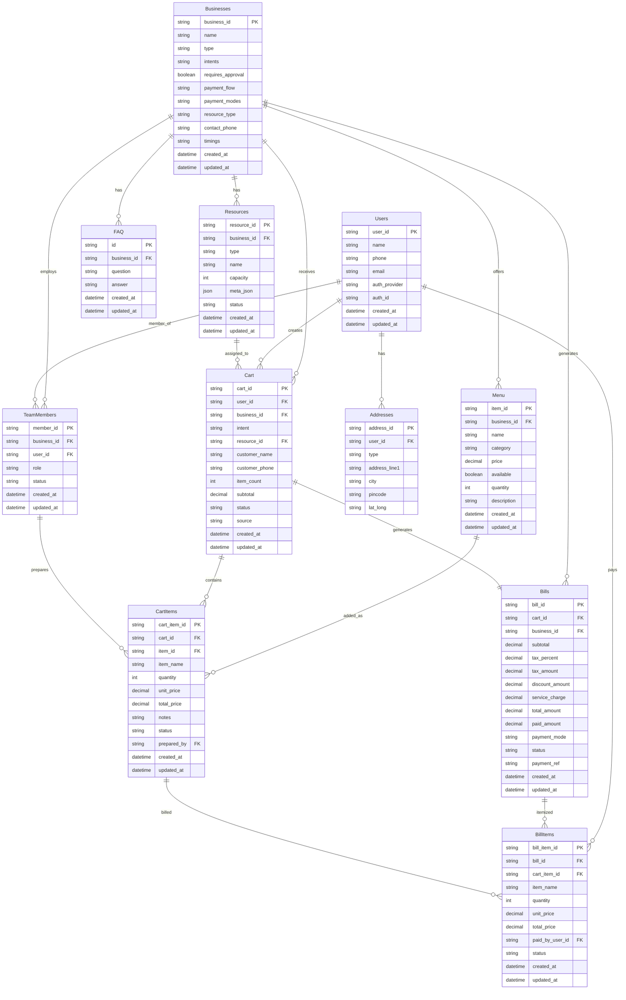

# Entity Relationship Diagram

## Mermaid ER Diagram



---

## Relationships Text Format

```
Businesses (1) ──── (N) Resources
Businesses (1) ──── (N) Menu
Businesses (1) ──── (N) FAQ
Businesses (1) ──── (N) TeamMembers
Businesses (1) ──── (N) Cart
Businesses (1) ──── (N) Bills

Users (1) ──── (N) Addresses
Users (1) ──── (N) Cart
Users (1) ──── (N) TeamMembers
Users (1) ──── (N) BillItems (paid_by)

Resources (1) ──── (N) Cart

Cart (1) ──── (N) CartItems
Cart (1) ──── (1) Bills

Menu (1) ──── (N) CartItems

Bills (1) ──── (N) BillItems
CartItems (1) ──── (N) BillItems

TeamMembers (1) ──── (N) CartItems (prepared_by)
```
