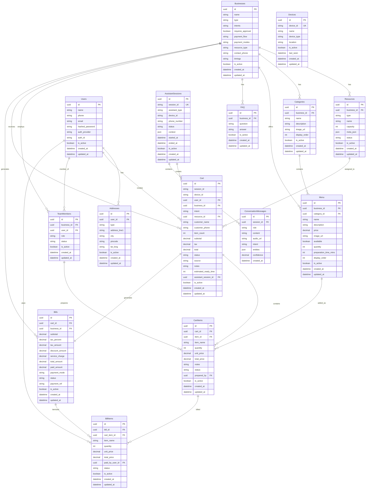

# Entity Relationship Diagram (Merged Schema)

> **Updated:** UUID (String 36) primary keys for all tables

## Mermaid ER Diagram



---

## Relationships Text Format

```
BUSINESS CONTEXT
════════════════
Businesses (1) ──── (N) Resources
Businesses (1) ──── (N) Categories
Businesses (1) ──── (N) Menu
Businesses (1) ──── (N) FAQ
Businesses (1) ──── (N) TeamMembers
Businesses (1) ──── (N) Cart
Businesses (1) ──── (N) Bills

MENU STRUCTURE
══════════════
Categories (1) ──── (N) Menu

USER CONTEXT
════════════
Users (1) ──── (N) Addresses
Users (1) ──── (N) Cart
Users (1) ──── (N) TeamMembers
Users (1) ──── (N) BillItems (paid_by)

ORDER FLOW
══════════
Resources (1) ──── (N) Cart
Cart (1) ──── (N) CartItems
Cart (1) ──── (1) Bills
Menu (1) ──── (N) CartItems
Bills (1) ──── (N) BillItems
CartItems (1) ──── (N) BillItems
TeamMembers (1) ──── (N) CartItems (prepared_by)

ASSISTANT CONTEXT (EXISTING)
════════════════════════════
AssistantSessions (1) ──── (N) Cart
AssistantSessions (1) ──── (N) ConversationMessages
```

---

## Tables Summary (15 Total)

| # | Table | Type | PK Type | FK References |
|---|-------|------|---------|---------------|
| 1 | Businesses | NEW | UUID | - |
| 2 | Resources | NEW | UUID | business_id |
| 3 | Categories | EXISTING+ENHANCED | UUID | business_id |
| 4 | Menu | MERGED | UUID | business_id, category_id |
| 5 | Users | MERGED | UUID | - |
| 6 | TeamMembers | NEW | UUID | business_id, user_id |
| 7 | Addresses | NEW+ENHANCED | UUID | user_id |
| 8 | Cart | MERGED | UUID | user_id, business_id, resource_id, assistant_session_id |
| 9 | CartItems | NEW | UUID | cart_id, item_id, prepared_by |
| 10 | Bills | NEW | UUID | cart_id, business_id |
| 11 | BillItems | NEW | UUID | bill_id, cart_item_id, paid_by_user_id |
| 12 | FAQ | NEW | UUID | business_id |
| 13 | AssistantSessions | EXISTING | UUID | - |
| 14 | ConversationMessages | EXISTING | UUID | session_id |
| 15 | Devices | EXISTING | UUID | - |
