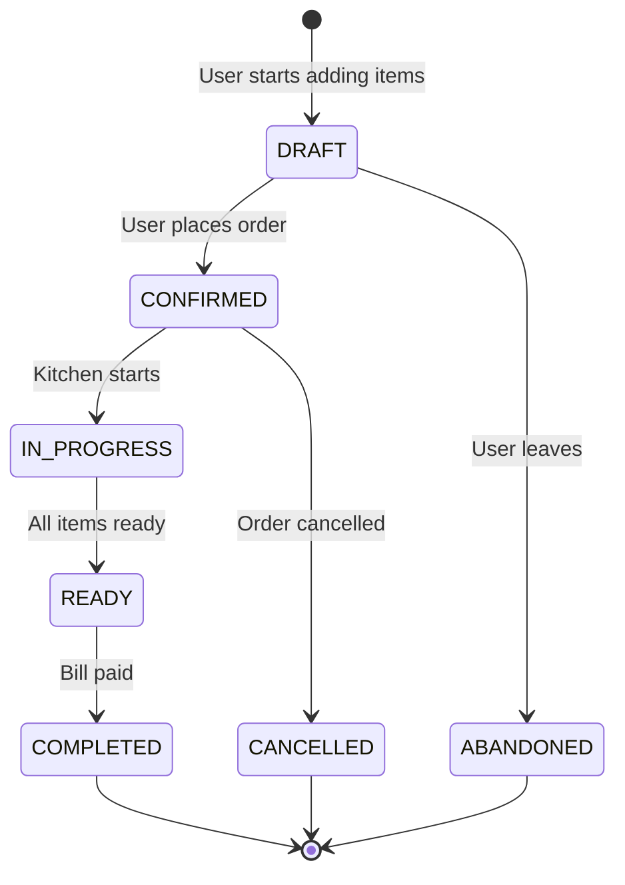
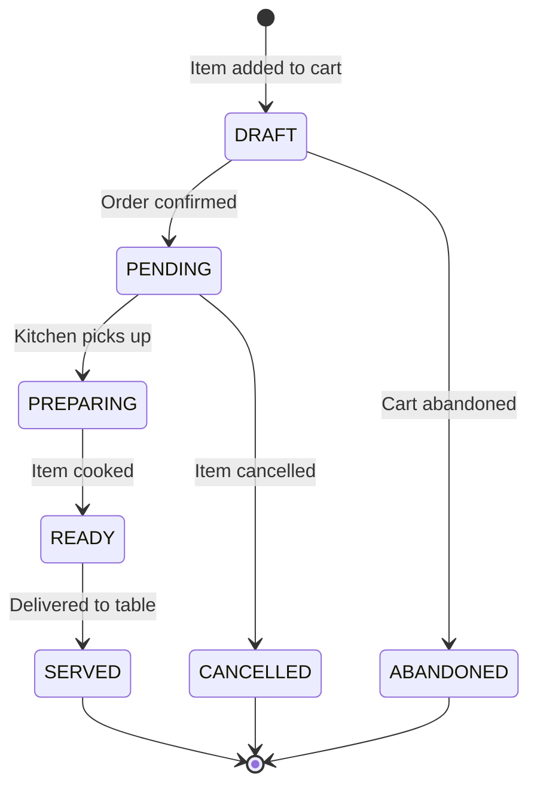
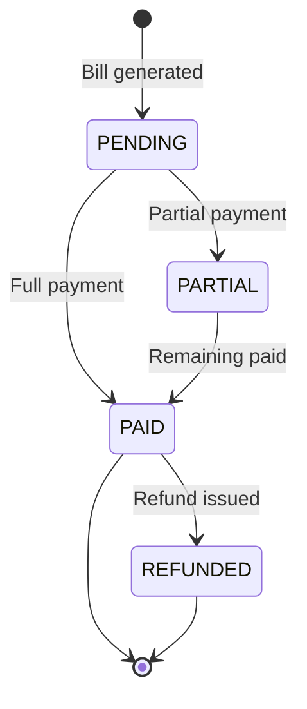
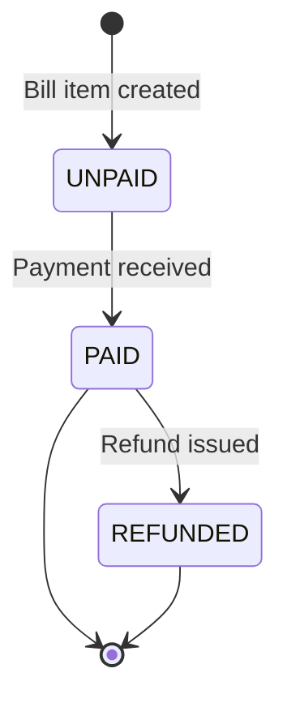
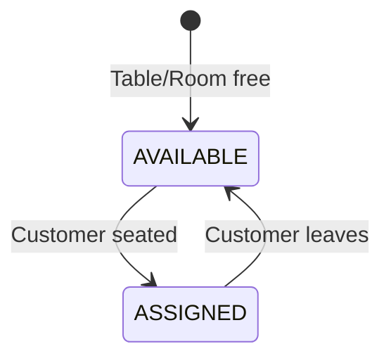

# Status Flow Diagrams

## 1. Cart Status Flow



### Cart Status Definitions

| Status | Description | Next Actions |
|--------|-------------|--------------|
| `DRAFT` | User is browsing, adding items | CONFIRMED, ABANDONED |
| `CONFIRMED` | Order placed, sent to kitchen | IN_PROGRESS, CANCELLED |
| `IN_PROGRESS` | Kitchen preparing items | READY |
| `READY` | All items ready for serving | COMPLETED |
| `COMPLETED` | Order finished, bill paid | - |
| `ABANDONED` | User left without ordering | - |
| `CANCELLED` | Order was cancelled | - |

---

## 2. CartItem Status Flow



### CartItem Status Definitions

| Status | Description | Who Updates |
|--------|-------------|-------------|
| `DRAFT` | Item in cart, not yet ordered | System |
| `PENDING` | Order confirmed, waiting for kitchen | System |
| `PREPARING` | Kitchen is cooking this item | Staff |
| `READY` | Item is cooked, ready to serve | Staff |
| `SERVED` | Item delivered to customer | Staff |
| `ABANDONED` | Cart was abandoned | System |
| `CANCELLED` | Item was cancelled | Admin |

---

## 3. Bill Status Flow



### Bill Status Definitions

| Status | Condition |
|--------|-----------|
| `PENDING` | paid_amount = 0 |
| `PARTIAL` | 0 < paid_amount < total_amount |
| `PAID` | paid_amount >= total_amount |
| `REFUNDED` | Refund processed |

---

## 4. BillItem Status Flow



---

## 5. Resource Status Flow



### Resource Status Definitions

| Status | Description |
|--------|-------------|
| `AVAILABLE` | Resource is free for use |
| `ASSIGNED` | Resource is occupied by a customer |

---

## Status Sync Rules

### When Cart Status Changes

| Cart Status | CartItems Status | Resource Status |
|-------------|------------------|-----------------|
| DRAFT → CONFIRMED | DRAFT → PENDING | - |
| CONFIRMED → IN_PROGRESS | (individual) | - |
| READY → COMPLETED | (all SERVED) | ASSIGNED → AVAILABLE |
| DRAFT → ABANDONED | DRAFT → ABANDONED | - |
| CONFIRMED → CANCELLED | PENDING → CANCELLED | ASSIGNED → AVAILABLE |

### Parent-Child Status Derivation

```
Cart.status = derive_from(CartItems[].status)

If ALL items DRAFT       → Cart = DRAFT
If ALL items PENDING     → Cart = CONFIRMED
If ANY item PREPARING    → Cart = IN_PROGRESS
If ALL items READY/SERVED → Cart = READY
If ALL items SERVED      → Cart = COMPLETED (after payment)
```
